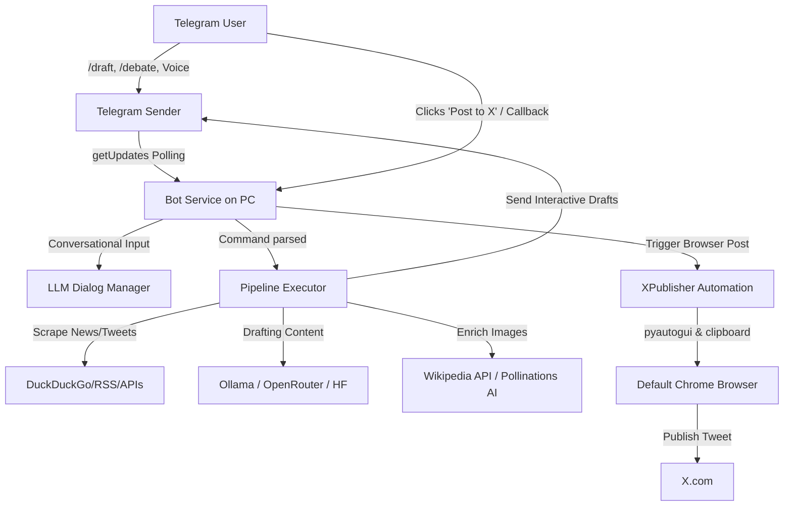

# 📱 X/Twitter Automation Agent with Interactive Telegram Remote Control

A fully automated tech-news aggregation, AI drafting, and automated publishing pipeline. The agent fetches trending topics, uses local or hosted LLMs to draft compelling posts (or threads) with reasoning-based image selection, and routes them to a **Telegram Remote Control Console**. From your phone, you can edit drafts using pre-filled templates, discard them, or trigger hands-free browser automation to publish them to X.com instantly.

---

## 🌟 Key Features

### 1. Interactive Telegram Approval Console (Remote Control)
When generating drafts via `/draft` or `/debate`, the bot acts as a mobile remote control publishing console. Drafts are sent directly to your Telegram with interactive inline buttons:
`[ 🚀 Post to X ]  [ ✍️ Edit Text ]  [ ❌ Discard ]`

*   **🚀 Post to X**: Sends a command back to your running PC agent. The bot automatically fires up the browser automation loop, opens X.com, pastes the draft text/threads, attaches the downloaded media, publishes the post, and edits the Telegram message to `✅ Posted to X!` (removing the buttons).
*   **✍️ Edit Text**: Powered by Telegram deep-linking (`t.me`). Clicking this opens your typing area with the entire draft prefilled, ending with a `(Draft ID: dr_xxxx)` tag. Make your changes and press send. The bot will automatically:
    *   Delete the old draft text and all associated photos from your chat history.
    *   Delete your edit command message to keep the chat history clean.
    *   Resend the updated draft (with new inline buttons and images) at the bottom of the chat—**no scrolling required**!
*   **❌ Discard**: Deletes the draft and its images, updating the Telegram message to `❌ Discarded.` and removing the buttons.

### 2. Debate & Devil's Advocate Mode
Interact with viral online discourse using the `/debate` command.
*   **Category Scraping**: Automatically scrapes viral tweets in a given category (AI, Crypto, Tech, Finance, etc.) or targets a specific X post URL.
*   **Stance Settings**: Drafts counter-arguments or supporting viewpoints (`contradict` or `support` stances).
*   **Interactive Review**: Outputs quote-tweets or direct reply drafts for approval with inline buttons before publishing.

### 3. Audio & Voice Commands
Do you prefer talking to typing? Send a voice message to the Telegram bot. It automatically downloads and transcribes the audio locally using `SpeechRecognition` and `pydub`/`ffmpeg`, executing the transcribed text as a command.

### 4. Conversational Dialog Manager
If you send conversational text that isn't a strict command, the bot engages its LLM-powered Dialog Manager to gather necessary parameters (e.g. topic, format, tweet vs thread, count) interactively before running the drafting pipeline.

### 5. Smart Multi-Source News Aggregator
Aggregates tech news from RSS feeds (Google News, Hacker News, The Verge, Ars Technica) and uses DuckDuckGo scraping. If primary feeds fail, it automatically falls back to paid API layers (NewsData, NewsAPI, Mediastack).

### 6. Intelligent Dual-Path Image Selection
The LLM reasons about what visual elements fit the tweet and outputs structured query parameters:
1.  **Wikipedia Entity Photos**: Queries Wikipedia for proper noun photos (e.g. Satya Nadella, NVIDIA logo) to fetch real-world assets.
2.  **Pollinations AI Generation**: Generates abstract/conceptual abstract artwork on-the-fly when Wikipedia matches are unavailable.

---

## 📐 Workflow Architecture



---

## 📋 Prerequisites & System Requirements
-   **Python**: Version 3.11 or higher.
-   **Operating System**: Windows (required for clipboard/pyautogui GUI automation).
-   **Web Browser**: Google Chrome or any default browser where you are **already logged into X/Twitter**.
-   **FFmpeg**: Required on the system PATH for voice message audio transcription.
-   **Ollama**: Required if running local LLMs (e.g. `llama3.2:3b`).

---

## 🛠️ Step-by-Step Installation

### 1. Clone & Set Up Virtual Environment
```powershell
# Clone the repository
git clone https://github.com/yourusername/TwitterAutomation.git
cd TwitterAutomation

# Create virtual environment
python -m venv .venv
.\.venv\Scripts\Activate.ps1

# Install in editable mode
pip install -e .
```

### 2. Configure Environment Variables
Copy `.env.example` to `.env` and fill in the values:
```powershell
copy .env.example .env
```

| Variable | Description | Example / Default |
| :--- | :--- | :--- |
| **LLM_PROVIDER** | LLM Engine (`ollama`, `openrouter`, `huggingface`) | `ollama` |
| **OLLAMA_MODEL** | Local model identifier | `llama3.2:3b` |
| **OLLAMA_BASE_URL** | Port Ollama is listening on | `http://localhost:11434` |
| **TELEGRAM_BOT_TOKEN** | Bot token from `@BotFather` | *Your Bot Token* |
| **TELEGRAM_CHAT_ID** | Your chat/user ID with the bot | *Your Telegram Chat ID* |
| **TWITTER_HANDLE** | Your X account username (used for thread lookup) | `my_twitter_handle` |
| **DEFAULT_STYLE** | Personality style (`neutral`, `sharp`, `spicy`, `ragebait`) | `ragebait` |

*Optional Fallback Keys (SerpAPI, NewsData, NewsAPI) can be filled in to improve fallback scraping success.*

### 3. Setup Ollama (Local AI)
1.  Download and install Ollama from [ollama.com](https://ollama.com).
2.  Pull your drafting model:
    ```powershell
    ollama pull llama3.2:3b
    ```

### 4. Install FFmpeg (For Voice Commands)
Ensure `ffmpeg` and `ffprobe` are installed and added to your System Environment variables PATH.
-   **Windows (via winget)**: `winget install Gyan.FFmpeg`

---

## 🚀 Running the Agent

### Start the Telegram Service
The primary interface for the agent is the Telegram background bot listener:
```powershell
tweet-agent bot
```
*Note: If starting the bot after it has been offline for a while, you can run it with `tweet-agent bot --drop-pending-updates` to ignore old queued commands.*

---

## 📱 Telegram Commands Guide

Message the Telegram bot directly using these commands:

| Command | Description | Example |
| :--- | :--- | :--- |
| **`/draft`** | Starts the interactive questionnaire to generate image-backed drafts. | `/draft` |
| **`/debate`** | Scrape trending tweets/specific post to generate quote-tweet counter-arguments. | `/debate` |
| **`/topic <topic> [count]`** | Immediately generates drafts for a specific topic (e.g. 3 drafts). | `/topic Microsoft 3` |
| **`/post <topic>`** | Generates a single tweet about a topic and posts it directly to X.com. | `/post SpaceX` |
| **`/post <topic> --posts <N> --interval <M>`**| Generates and schedules a queue of posts to publish every M minutes. | `/post Nvidia -p 3 -i 60` |
| **`/cancel`** | Cancels the current questionnaire or command state. | `/cancel` |
| **`/status`** | Verification check to ensure bot is active on the PC. | `/status` |
| **`/quit`** | Gracefully shuts down the background PC agent process. | `/quit` |

---

## ⌨️ CLI Console Control
You can also trigger the pipeline directly from the command line:

*   **Batch Draft Generation (Dry Run)**:
    ```powershell
    tweet-agent run --topic "OpenAI" --count 3
    ```
*   **Direct Autoposting from CLI**:
    ```powershell
    tweet-agent run --topic "SpaceX" --count 1 --post
    ```
*   **Debate Mode CLI**:
    ```powershell
    tweet-agent debate --category AI --count 2 --stance contradict
    ```

---

## 🔍 How GUI Browser Posting Works
Since the agent uses **browser automation**, it does not require paid X API keys.
1.  The agent opens a Chrome tab pointing to an X.com compose Intent URL with pre-filled text.
2.  It copies the downloaded image to your Windows clipboard.
3.  It simulates keystrokes: focuses the window, pastes the image (`Ctrl+V`), waits for the upload, and triggers publication (`Ctrl+Enter`).
4.  **Important**: Keep your hands off the mouse and keyboard during the 20-second automation loop to ensure focus isn't lost.

---

## 🛠️ Troubleshooting

### 1. PyAutoGUI Focus Issues / Failed Posts
*   **Problem**: PyAutoGUI inputs do not register, pasting fails, or the X compose window opens but doesn't post.
*   **Fix**: Do not click on other windows while the automation is active. Keep the Chrome browser visible on screen.

### 2. DuckDuckGo Rate Limits (403 Forbidden)
*   **Problem**: You receive a `403 Ratelimit` error when scraping topics.
*   **Fix**: This is normal for search scrapers. The bot automatically switches to fallback RSS feeds and API layers if configured in `.env`.

### 3. FFmpeg Missing Error
*   **Problem**: Send a voice message and see `RuntimeError: ffmpeg/ffprobe not found`.
*   **Fix**: Confirm FFmpeg bin folder is added to your path. Open a fresh Powershell window and run `ffmpeg -version` to verify.